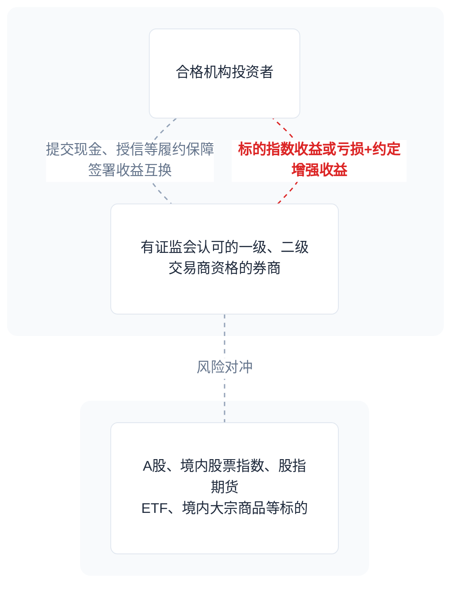

# 写在离职前

叔本华认为人生是悲观且虚无的，人生像摆钟，在痛苦与无聊之间摇摆，当欲望得不到满足时就痛苦，当欲望得到满足时就无聊。

我是因为工作过于无聊而选择离职的，无聊比单纯痛苦更折磨人。当我意识到就连时间的流逝都逐渐加快时，就知道这里已经不再有什么新事物值得我投入了。

曾经在大学里熬夜翻文献、写thesis和做presentation slides都没这么感到如此无力，因为在读书期间，目标和方法都是明确的，人只要愿意被规训或服从某种秩序，按照规则工作就能获得奖励。虽然在职场环境里和在学校里一样是处处受限的，但是职场多了选择和放弃的权利，有机会成本就会有遗憾。其实我是不想离开这个给自己有安全感的地方，但我知道时间久了，人是会神奇地适应恶劣的环境，逐渐失去说真话的能力，无法活在真实中，直到认知退化成被人讨厌的老登。

知晓天空之蓝的人大多知晓大海的广阔，但由于各种原因未能亲眼看到宽阔的海洋，但不亲自去尝试一定会留下遗憾。

我从不认为逃离故里这件事是值得赞扬的，因为逃离家乡的人可能无法与原生环境和解，更像是逃难。人会受到家庭、人脉圈子、社会文化等因素影响，生命生而自由，却无往不在枷锁之中，会发现自己不知何时多了这个地方的恶习，如官僚文化常见的改口径、甩锅和撇清责任，所谓融入环境里是非常可怕的事情。

我提辞职是犹豫了大半个月，使我困惑的是对自己想法不自信、做事犹豫不决的自己。我习惯了依靠理性去做决策，因为我是内心软弱和情感敏感的，我永远记得做交易的教训与经验：在交易之前就必须权衡好盈亏比、胜率和频率，并设置好止盈与止损线，有纪律地去执行，因为有了仓位后的交易者是难以保持理性的，这里边有贪婪恐惧的情绪，也有基于过去生活经验固有的认知偏差。

我离开是为了执行止损这一操作，去年就给了自己一个deadline：职场氛围和工作内容没发生本质改变就离开。因为公司是采用类似日本年功序列的制度，所谓资质是靠Title和熬出来的，相对应的是，真有本事的人就不会一直待在这里了。有的同事有才华但得不到重视，熬下来的同事的技能偏好已经和这家公司捆绑，基本不会主动去学新的技能，还有有毒的内部审计、内核管理和风控合规文化。客观来看这是优秀的大企业管理，有标准化的工作流程和高度集中的业务发展，还有一丝不苟的内控管理，只是我自己不喜欢这套制度，把人限制的太死，没有任何创新的空间。

尽管我非常不想承认这两年多的学习与付出都是无意义的，但能做的只有截断亏损，主动做出改变换个环境。到新的领域里相当于转行了，新的工作不再和机构投资工作有关，意味着要放弃这两年多大部分的专业积累。庆幸的是没用上《发布证券研究报告》的资格，不然就是天天生产数字垃圾（指研报）。

放弃是人类的高阶智慧，不因沉没成本而套牢，不被舒适安全感所奴役，不因过去的自己而困惑。

我会把我这两年多学到的所有专业知识和二级市场经验没有一丝保留地记录下来，算是对证券行业祛魅了：二级市场没有秘密，只有信息差和认知差距。

# 券商自营权益在做什么

券商自营业务在整个“买方”都属于冷门且不入流的角色，一方面隶属于国资委系统，资金风险偏好保守，另一方面因券商有经纪资管等业务带来近乎无风险的收益，内部资金成本（外界可以理解为加权平均资本成本WACC里的税后债务融资成本）一般会比LPR（贷款市场报价利率）高，用自有资金投资追求市场收益，既要吃Beta和Alpha，又要控制波动和最大回撤，是难以权衡资金成本和市场机会的。在这种体系工作过的人都知道，鱼和熊掌都要的管理是非常危险的操作，结果是暴露大量被低估的肥尾风险（在期望分布的曲线中，尾部区域比正态分布更粗长）。

我把券商自营权益类业务分为以下几个核心业务，风险从小到大：

| 业务                                         | 风险级别                                                                                                       | 逻辑                                                                                                                                                                                                                                                                  |
| -------------------------------------------- | -------------------------------------------------------------------------------------------------------------- | --------------------------------------------------------------------------------------------------------------------------------------------------------------------------------------------------------------------------------------------------------------------- |
| 做市业务（同行大多从自营业务中剥离独立出来） | 中低风险，主要看对冲和隔夜敞口管理                                                                             | 在特定市场持续双边报价吃价差，维护流动性，部分ETF基金品种有基金公司的流动性收入报酬                                                                                                                                                                                   |
| 其他综合收益科目（OCI账户）                  | 中高风险，利润表看不见公允价值变动不代表不存在，看选股能力和赛道拥挤度（主要是险资、券商公司配置盘）           | 一篮子高股息股票投资，企业根据其他会计准则规定未在当期损益中确认的各项利得和损失，保险、券商机构会买入一篮子高股息资产、债权投资放进OCI账户，其公允价值变动不纳入利润表，只有股息和票息纳入利润表，末期卖出时公允价值变动都体现在当期损益上，可充当会计上的利润调节器 |
| 量化Alpha/指数增强策略（多因子模型）         | 中高风险，看策略容量、拥挤度、基差、回撤管理                                                                   | 通过挖掘长期高（Rank）IC IR的截面和时序因子，多因子打分选股，目前大多使用深度学习，Alpha收益来自市场的错误定价                                                                                                                                                        |
| 委外投资                                     | 高风险，大多数产品投前业绩优秀，投后业绩不可持续，取决于基金投研方法论，越是看重历史业绩，风险越大（是看似矛盾的） | 机构自己做不了的、玩不明白的、玩不过别人的，就外包给私募和公募，必要时用FOF单一资产管理计划作为通道                                                                                                                                                                   |
| 二级市场投资                                 | 风险最大，肥尾分布                                                                                       | 券商自营在二级市场投资上没有任何优势，只能尽可能吃Beta，跟踪趋势                                                                                                                                                                                                          |

## 做市业务

一言以蔽之，做市是一门需要特许经营权的牌照业务。竞争者有限，策略与技术要求不高，但和量化交易一样吃机房硬件和交易系统。

### 对冲管理

在股转、北交所、科创版市场，标的做市难以找到合适衍生品对冲或无法对冲，暴露净多头，本质上是一种主观多头投资，做市赚价差增厚收益。

ETF、LOF基金做市，主要风险在于对冲管理，股指期货IC、IM常年深贴水（IM贴水大部分时间年化8%以上），这里面分为能完全对冲和无法对冲的：

- 近乎或完全对冲的品种，像沪深300、中证500等宽基指数是能直接用股指期货对冲Beta，中证A500约等于沪深30+中证500+（两者都没交集的，占约1%-3%），若无股指期货可用挂钩ETF的期权，根据期权平价公式，卖出N份平值看涨期权 + 买入N份平值看跌合成出来的损益曲线是线性的，和股指期货空头类似，只需要做好组合Delta管理与期权合成基差（升贴水会折算到期权权利金内），这类大部分敞口都能找到合适对冲标的的风险就只有基差，整体做市盈亏 = 价差 + 经手费返还 - 股指期货对冲成本 - 交易费用 + 来自基金公司的流动性收入；
- 不能完全对冲的品种，像各种行业、风格策略类ETF，可能和IC、IH、IF、IM的权重股几乎没交集，只能通过计算相关系数来判断现货与对冲端的相似性，选择过去1-3年行情分别计算Pearson线性和Spearman秩相关性，两者系数在0.7以上被认为是有高相关性，可考虑等额市值对冲。尽管如此，不同ETF与对冲标的的Beta大小不同，Beta = 现货与对冲标的日收益率的协方差 / 对冲标的的方差，Beta越大则对冲越多，按照这个逻辑来对冲，剩下不可对冲的就是Alpha或残差；
- 净敞口动态管理，既然必定存在无法被完全对冲的部分，那么可以利用做市的机制，每天只留存为满足报价义务的持仓量（保守在300-500万之间的持仓市值），将此设为下限，使用多因子模型，目标函数是做市标的与对冲标的相对Alpha收益率，通过调整一篮子基金组合中不同基金的权重，通过日频截面上的选择获取更多的Alpha增厚做市收益；
- 无法对冲的品种，像一些QDII和商品类ETF是T+0机制，有时标的换手率会超200%，只需要通过控制买卖价差尽可能“做平”，控制隔夜敞口，加上场内外申赎套利，理论收益比上述几种都要多。

## 场外衍生品

互换业务和场外衍生品业务是机构投资者bug级别的工具，券商与同行交易只占用极少的保证金甚至无需缴纳保证金，几乎无资金成本，与同行先后双方信评再授信，以信用换取杠杆，只占用公司负债表和证券公司层面风险指标。

### 收益互换

- **收益互换卖出方作为融资工具**，存续期间内能挪用对方的保证金进行二级市场交易，期末支付约定好的增强收益，如果预期远期市场基差 + 资金成本 < 约定增强收益，那么这笔互换就值得做，所以本质上是在做远期的基差交易。如果卖出名义本金1亿元挂钩中证500的收益互换，大概就用1300万的保证金开IC多头吃贴水，然后留1000万补保证金，剩下的7500万可自由支配；
- **多空收益互换**（Direct Market Access简称DMA），做多一篮子股票作为保证金，根据交易对手方的券池选股进行融券并支付券息，采用反向的多因子策略，目标函数是跌幅或跌幅Rank，采用双方授信，几乎不占用资金；

### 场外期权

相关书籍：Options, Futures and Other Derivatives 《期权, 期货及其他衍生产品》

相关项目：[galatech/pricelib](https://gitee.com/lltech/pricelib)

自动敲入敲出期权产品（Autocallables），主要做雪球、凤凰、FCN、DCN等结构，结构条款有挂钩标的、存续时长、敲入价格、敲出价格、早利票息、红利票息、年化收益率、锁定期、保证金比例、敲出观察日、敲入观察日等要素。

根据Black-Scholes Model期权定价公式，**场内外期权的内在价值理论上只由隐含波动率（Implied volatility）决定**，因为其他要素都是客观且既定的，二级市场上的IV是由期权价格反推的数值，所以期权交易本质上是对未来波动率进行下注。进而得知，卖空波动率（雪球、卖出跨式期权等）是有限收益、潜在更大损失，反之亦然。

客户下单后，券商交易台要对冲头寸来配平风险敞口，根据雪球产品组合的Delta值用股指期货进行买卖，下跌时逐渐加仓，上涨时逐渐减仓，在敲入价格和敲出价格区间内自动高抛低吸，期初建仓只会用到50%-80%的仓位，接近敲出价格，就要决定是否平仓，若接近敲入价格，就要把仓位加满甚至到达近120%的仓位，由于敲入敲出观察日几乎都是根据交易日收盘价判定，但收盘前流动性稀薄，迅速平仓会承担大量摩擦成本，一般会提前至少半小时根据经验逐步平仓，如果判断错误可能会造成亏损。交易台组合如果遇到组合负Gamma的情况，为了维持组合Delta中性，对冲操作会变得追涨杀跌，不难看出雪球产品是在做多资产的同时做空波动率。

尽管雪球产品提供了一定的安全垫，可以个性化制定敲入价格和敲出价格等条款，但是这些要素都会调整交易台的报价（指票息或年化收益率），场外期权主要用Monte Carlo模拟、PDE有限差分、积分法等方法进行定价。

| 方法                        | 定价原理                                                                                                                                                             | 计算逻辑                                                                                                                                                                                                                                                                                                        | 波动率                                                                                   | 优缺点                                                                                                 |
| --------------------------- | -------------------------------------------------------------------------------------------------------------------------------------------------------------------- | --------------------------------------------------------------------------------------------------------------------------------------------------------------------------------------------------------------------------------------------------------------------------------------------------------------- | ---------------------------------------------------------------------------------------- | ------------------------------------------------------------------------------------------------------ |
| Monte Carlo模拟             | 前向路径模拟（GBM/LocalVol/Heston等随机过程），生成N条路径（大数定理），计算每条路径不同时间节点的payoff，得到现金流总和后取平均值，票息就是该产品存续期间的收益期望 | 每条路径跟踪产品的历史状态（是否已敲入、累计票息水平、是否已敲出），每个离散的观察日判断：价格≥敲出栏→立即赎回+累计票息终止；否则累计票息（或条件滚雪球），继续下一段，敲入按交易日观察。                                                                                                                       | 根据伊藤引理（漂移和扩散）直接沿路径插值局部波动率 $σ(S,t)$ 或模拟Heston随机波动率过程   | 实现最简单、通用、验证基准首选。 慢（百万路径需数十秒）、Greeks波动大，对不适合用语盘中盯盘组合Delta。 |
| PDE有限差分（状态网格法）   | 后向时间步进求解BS/PDE（显式/隐式/Crank-Nicolson），网格(S, t, 额外状态变量)                                                                                         | 状态扩展关键：基础1D网格(S,t)，但雪球需额外维度/状态变量（e.g. 累计票息档位或敲入标志，离散化成2D~3D网格）。非观察期：连续PDE演化价值函数；在每个观察日跳跃条件：对当前网格每个S，按状态判断——敲出价格以上→价值=赎回价+累计票息；否则更新状态变量（票息+1或滚雪球），价值延续到前一时段。敲入处理类似条件边界。 | Dupire方程直接嵌入PDE网格                                                                | 速度快、Greeks平滑（直接从网格差分得Delta/Gamma/Vanna/Volga）、精度高。日常盯盘、对冲、再平衡首选。    |
| 积分法（FFT/数值积分/QUAD） | 观察日间用密度函数/特征函数数值积分（FFT加速O(N log N)），递归计算条件期望价值                                                                                       | 概率递归：从到期向后（或向前）积分转移密度：在每个观察日积分可能未来价格的分布，按敲入和敲出的概率直接加权payoff或条件延续价值；累计票息通过条件概率或状态概率质量函数处理（适合简单无敲入线或二元小雪球）。不需全路径，只需离散日转移。                                                                        | 需要常数波动率或有闭式特征函数模型（Heston Fourier、Levy过程），无法动态调整预期波动率。 | 速度快，适合快速报价、精度高，但不适用于多复杂结构产品。                                               |

卖场外衍生品，一般会给客户报更差的票息以留一定的对冲亏损和利润预算，由于个性化的场外衍生品都是非标准化的，它的价格是没有二级市场竞争的，也难以转让。目前券商一级交易商的交易台都有做这个业务提供风险管理服务，也可以给经纪业务定制高风险的结构化理财产品。

如果投资者非常了解以上理论，场外期权是没有必要的存在，散户需要的是交易台承诺的产品票息，但这背后是围绕概率与波动率的游戏。

## 量化多因子策略

相关书籍：石川的《因子投资》

相关项目：微软的[Qlib](https://github.com/microsoft/qlib)，高盛的[gs-quant](https://github.com/goldmansachs/gs-quant)

简化的业务流程（本人非专职量化开发，仅供参考）：

1. 准备数据：买数据源，接行情接口，检验数据真实性，去NA和null，适当填充，去极值，z-score标准化；
2. 因子挖掘：主要有遗传算法挖因子、基于理论逻辑的表达式两种方法，为了避免泄露未来函数，价格要用后复权（以起始价为基准复权），滚动处理要用rolling()；
3. 因子筛选：预测未来n根K线的收益率或分类结果，与因子值，测Pearson IC、Spaerman IR、IC_IR、单因子回测的夏普比例，然后再测因子间的协方差矩阵剔除共线性的因子，筛选出各自低相关的因子，再用ElasticNet、Ridge岭回归验证因子有效性；
4. 投资组合权重分配：根据因子打分和排序结果选股，根据风险平价、预期波动率、均值-方差优化等方法分配权重；
5. 超参数调整更新因子的权重：用OLS方法分配非线性权重，一般用集成学习（LightGBM、XGboost）会更为稳健，用LSTM（长短期记忆）、TCN（时间卷积网络）等神经网络在大规模复杂数据的处理中表现更好，新兴的端对端学习直接将原始因子作为输入，目标函数是最小化预测误差，因子权重是隐藏在模型参数内，无需人工干预，但需要大量算力、容易过拟合、不可解释；
6. 反复调整参数、训练、样本外回测；
7. 模拟盘，做上线前的测试，主要解决行情延迟、系统稳定性、控申报速率、信号生成等非策略环节。

### Barra风险归因

Barra风险模型（现属MSCI）是量化投资中衡量和管理组合风险的行业标准模型，用于分析量化策略组合的持仓，通过多因子框架将组合收益分解为国家、行业和10种风格因子（如规模、价值、动能等）以及特有风险。

在 Barra 模型中，单一股票 $i$ 的收益率 $r_i$ 表达为：

$$r_i = \sum_{j=1}^{K} X_{ij} f_j + u_i$$

其中：$X_{ij}$：股票 $i$ 在因子 $j$ 上的因子暴露度 (Factor Exposure)；

$f_j$：因子 $j$ 的因子收益率 (Factor Return)；

$u_i$：股票 $i$ 的特异收益率 (Specific Return / Residual Return)。

投资组合的总收益 $R_p$ 是各成分股收益的加权总和，修正后的归因公式如下：

$$R_p = \underbrace{\sum_{j=1}^{K} \left( \sum_{i=1}^{N} w_i X_{ij} \right) f_j}_{\text{因子收益贡献}} + \underbrace{\sum_{i=1}^{N} w_i u_i}_{\text{特异收益贡献}}$$

如[米筐](https://www.ricequant.com/doc/rqdata/python/risk-factors-mod)提供的CNE5风格因子结构：

| 风格因子           | 细分因子 | 说明                                                      |
| ------------------ | -------- | --------------------------------------------------------- |
| Liquidity          | STOM     | Monthly share turnover 月换手率                           |
|                    | STOQ     | Quarterly share turnover 季换手率                         |
|                    | STOA     | Annual share turnover 年换手率                            |
| Leverage           | MLEV     | Market Leverage 市场杠杆                                  |
|                    | BLEV     | Book Leverage 账面杠杆                                    |
|                    | DTOA     | Debt to asset ratio 资产负债比                            |
| BTOP               | BTOP     | book to price 账面市值比                                  |
| Earnings Yield     | ETOP     | Trailing Earnings-to-Price ratio EP 比                    |
|                    | EPIBS    | Analyst predicted earnings to price 分析师预测 EP 比      |
|                    | CETOP    | cash earnings to price 现金盈利价格比                     |
| Growth             | EGRLF    | Predicted growth 3 year 分析师预测长期盈利增长率          |
|                    | EGRSF    | Predicted growth 1 year 分析师预测短期盈利增长率          |
|                    | EGRO     | Historical earnings per share growth rate 每股收益增长率  |
|                    | SGRO     | Historical sales per share growth rate 每股营业收入增长率 |
| Momentum           | RSTR     | Relative strength 相对于市场的强度                        |
| None_linear_size   | MIDCAP   | None_linear_size 非线性市值在新模型中改为中市值           |
| Size               | LSIZE    | size 规模                                                 |
| Beta               | BETA     | beta 贝塔                                                 |
| Resival Volatility | HSIGMA   | Hist sigma 历史 sigma                                     |
|                    | DASTD    | daily std dec 日标准差                                    |
|                    | CMRA     | Cumulative range 累计收益范围                             |

通过Barra归因分析，可以将有上百只个股的持仓明细，映射到统一的多因子中。有效拆解基金的收益来源，以及在风格、行业等因子上的风险暴露与偏好，从而将量化这个黑盒的个股变动转化为可解释、可预测的线性回归模型。

## 委外基金投资

机构和散户有着同样的烦恼，为什么历史业绩优秀的基金（高夏普、Sortino、Calmar比例），钱投进去之后业绩大多都不及预期。

- 首先要搞清楚拟投资基金是什么类型的，这里指的不是股票型、混合型等简单的分类，而是看在做什么市场、品种、行业，具体策略和收益来源是什么（必须要记清楚，它后续如果不按照策略执行就可能有问题）；
- 根据产品说明得到一个相近的业绩参考，例如做指数增强的策略就看挂钩指数的全收益率（含分红再投）；
- 基金经理至少要有3年以上的业绩，一般要求长期年夏普、Sortino、Calmar、信息比例（按策略类型选择指标）等绩效指标大于0.8；

| 基金策略               | 基准参考                                                          | 分析方法                                                                                                                             | 业绩可持续性                                                                                                                                     |
| ---------------------- | ----------------------------------------------------------------- | ------------------------------------------------------------------------------------------------------------------------------------ | ------------------------------------------------------------------------------------------------------------------------------------------------ |
| 主观股票多头       | 根据市值划分的宽基指数                                            | Brinson绩效归因：资产配置收益（仓位大小）+个股选择收益（截面上选股收益），超额收益绩效拆解=资产配置超额+个股Alpha+交互作用，夏普比例 | 业绩大多不可持续，必须调研问投资经理的投资方法论，把历史业绩的归因搞清楚，是因为择时、选股、选行业还是纯巧合，问过去的调仓依据，遇到回撤如何应对 |
| 量化指数增强/Alpha中性 | 指数增强策略和挂钩指数全收益率比较，Alpha中性策略和同类私募基金比 | 信息比例、Sortino比例、日超额分布、Barra归因、Calmar比例                                                                             | 持续性一般，长期有效的Alpha收益稳定且大差不差，风险取决于基差、策略容量和因子拥挤度                                                              |
| CTA                    | 无特定参考基准，商品CTA可参考南华商品指数                         | 因人而异，分析具体策略风险，弄清楚在什么钱                                                                                           | 视策略而定，国债期货曲线价差交易、日内回转交易等无隔夜敞口的一般业绩可持续，裸多头跟踪趋势的业绩大多不可持续                                     |
| 套利类                 | 十年期国债收益率，看当年出现巨大价差的机会多不多                  | 因人而异，分析具体策略风险，弄清楚在什么钱                                                                                           | 双卖IV、日历价差有尾部风险，业绩不可持续；日内回转看交易员水平；ETF申赎、期现、跨期套利业绩可持续                                                |

反常识的是，历史业绩不是一个好的绩效指标，公募基金产品介绍底下的风险揭示“历史业绩不代表未来业绩”是客观中立的描述，不只是用来撇清风险揭示的责任。如果投资经理只是抄作业或复制指数，碰上行情好，各种绩效指标也可以看起来不错，所以要通过调研弄清楚历史基金运作**多次调仓、选股、择时的依据，判断这一逻辑是否可复用到以后的市场环境中，基金经理是否按照这套方法论严格执行，历史有没有出现过风格飘逸，再看基金的风险管理措施（VaR、波动率、集中度等）**。由于大部分基金都不会向投资者披露季频、月频率以下的持仓明细，如果基金换手率较高（年换手率超300%），基于月度、季度的Brinson收益拆解很可能没意义。量化基金做基于Barra模型的因子归因，套利类、CTA、衍生品类的基金重点关注每次净值回撤的特征以及回撤修复周期。

## 主观多头策略

## 常规套利策略

- ETF申购赎回：2026年1月国家队打压降温，华泰柏瑞沪深300ETF盘中价格一度比IOPV低0.5%+，这时买入基金同时一级市场赎回基金，换成一篮子股票，再卖出，注意其套利成功还要求套利的价差区间至少足够覆盖固定成本和冲击成本，由于当时价差较少，无法吸引足够多的资金套利；
- 期现套利：2024年的924行情，宽基指数空头被轧空，市面上的量化中性策略开始放弃中性，市场情绪高涨叠加大量空头仓位回补，当月IC、IF、IM股指期货合约绝对价差都有2%出头，做空股指期货同时做多一篮子股票，注意是有部分股票涨停无法买入或停牌，需充分考虑市场流动性。

套利的核心逻辑根植于“一价定律”，即同一资产在不同市场的定价理论上应当对等。然而，受市场情绪、认知偏差及流动性差异影响，价差空间（Spread）时常出现。ETF套利正是利用其在一级市场（申赎）与二级市场（交易）之间的定价偏差，配合“T+0”循环申赎机制与现金替代规则，捕捉低风险的绝对收益。

在实际操作中，IOPV（基金份额参考净值）是衡量折溢价的关键锚点。交易所依据基金管理人每日披露的申购赎回清单，按成分股最新成交价每15秒更新一次动态净值。需密切关注清单中的最小申购赎回单位（通常达数十万份，对应数百万资金门槛）及成分股构成。为了应对成分股停牌或流动性问题，机制中引入了“现金替代”方案，其具体规则如下表：

| 现金替代类型 | 申购规则                       | 赎回规则                         |
| ------------ | ------------------------------ | -------------------------------- |
| 必须         | 必须使用现金替代该证券         | 必须以现金形式退还该证券对价     |
| 允许         | 可选择现金或实物证券申购       | 不允许现金替代，必须交付实物证券 |
| 禁止         | 严禁现金替代，必须交付实物证券 | 严禁现金替代，必须交付实物证券   |

对于“允许现金替代”的证券，管理人会预设现金替代溢价比例。该比例用于覆盖管理人代为买入股票时的不确定成本及手续费。清算时，若预收金额高于实际成本则退还差额，反之则要求投资者补足，这种“多退少补”的机制确保了基金持有人利益的公平性。

具体的套利执行路径分为溢价与折价两种模式：

- 溢价套利：当二级市场交易价格 > IOPV时，投资者在二级市场买入一篮子股票，一级市场申购ETF份额，随后在二级市场卖出份额，锁定溢价。

- 折价套利：当二级市场交易价格 < IOPV时，投资者在二级市场买入ETF份额，一级市场赎回得到一篮子股票，随后在二级市场卖出股票，获取折价收益。

尽管套利在理论上风险极低，但实际收益受限于固定成本（佣金、税费）与冲击成本。由于套利机会稍纵即逝，大规模资金的介入会对价格产生冲击，尤其是流动性较差的成分股会拉大风险敞口。因此，成熟的套利策略必须依托专业的交易系统，实现一篮子股票的高速同步下单，以确保在价差收敛前完成头寸闭环。

对散户而言，只需要掌握场内外转托管以及股指期货（50万门槛）工具做场内外、ETF与期货、股指跨期套利即可，买卖或场内赎回一篮子股票需要接口和工具，资金量门槛较高，券商经纪有严格的异常交易监测与风控，不推荐做。

## 常见的投资错误

### 虚伪的Beta投资者

很多人自诩“自上而下的配置盘”方法论，信奉桥水基金CEO Ray Dalio畅销书两册《原则》中的“21条高原则、139条中原则和365条分原则”、债务危机理论、经济上东升西降观点。例如通过做主观宏观择时来决定开几成仓，一会捕捉市场噪音来做非理性的交易，喜欢抄作业（券商研究所的主流观点），高度依赖市场叙事，买近10个高度相关的国内A股宽基和行业ETF品种。因为他们在行业研究方面“深度的几乎啥都不懂，但表面的什么都懂一点”（想不到更好的表述），所以要进一步分散风险，殊不知这些ETF拼凑出来的成分和中证A500相似，而回测结果和实盘都没跑赢指数。如果因为自己不懂而刻意分散，必须吃这份“免费的午餐”，结果是没分散到任何市场风险。而且考虑ETF挂钩的是市值或某种指标加权的指数，在权益投资上理应比只投资个股要下更重的仓位。

既然过去和现在都在赚宽基指数上涨的钱，主动暴露Beta敞口，那么就应该去买近期Beta更大的品种。不要自欺欺人，靠买“一篮子”股票或ETF来分散风险。如果资产间大部分时间都是同起同落（Comovement）的，说明从一开始协方差矩阵或预期波动率没制定好，才有后面择时控制风险敞口、回撤等问题，所以自上而下的配置与主观择时是矛盾的。主观择时的目的是通过仓位大小来调整组合的波动率和预期最大回撤，如果同时择时与配置，说明对资产间相关性的理解与控制风险暴露这两者都没做好。

有个很简单的检验方法，如果按单位净值计算，买一篮子同起同落的ETF一直跑输指数，算上夏普（日收益率均值/波动率），长期年夏普小于0.8，再看下投资期间内不同资产之间的协方差矩阵，如果大部分资产都表现高度相似，那是客观意义的失败。

我的投资理念更倾向格雷厄姆和多德的《证券分析》，坚定做基本面研究，而不是用自上而下的视角去做层层宏观预测、协方差假设、控波动率和行业筛选。

### 基本面的局限性

**不要用基本面去解释既定发生的价格变化**，这个错误从我入职到离职，同事们都在不断重复地犯错。从市场参与者的角度来看，价格波动比叙事产生一定来的更早，而不是先有叙事再有价格；其次是基本面只能在未被市场price in消化的时候对未来做出的合理推测，它不能解释为什么价格还未波动，否则进入了自证陷阱。这也是为什么我们看到长期稳定赚钱的投资经理不会把宏观当作重要因素，反而是更注重K线组合、市场资金面、流动性等微观层面，因为大部分**共识性的宏观叙事不能作为择时依据**。

举个简单的例子，2026年1月底2月初，国内外的黄金都暴跌了，但在暴跌之前，美债危机、美元贬值、全球主权国家债务积累、贸易去美元化、逆全球化等**超长期**因素都在近1年内在市场里充分交易甚至全球投资者都有这样的共识，而触发回撤的是美联储降息预期下降、下任美联储主席凯文·沃什独立货币政策、美国政府持续停摆抽水等因素带来美元流动性收紧。如果这时还要用以往这些超长期因素去左侧抄底，那要非常谨慎，因为美元流动性、美联储政策都带来了新的变数，如今市场没有明显预期差。我不是说在2026年2月抄底黄金就一定不对，我想表达的是现在左侧买入比起去年底宏观未被过度交易（未完全price in）时的盈亏比、胜率都要差很多。如果之后继续创新高，且还用超长期因素去解释上涨，那就是自我正反馈。这是很危险的，因为全球的投资者都在参与黄金的定价，**黄金要么有新的投资逻辑出现，要么继续有全球投资者（包括央行、机构和散户）的共识**，才能继续推动价格，但这个时候大家没有任何信息或认知差了，风险和收益可能是对称的甚至风险更大。黄金是有可能进一步突破2026年1月29日的高位，继续新高，我观察到2026年的黄金价格受美元流动性影响很大，呈现风险资产的特征，预计在流动性危机面前黄金是无法避险的，避险只是叙事，黄金品种的交易比较烧脑，需要持续跟踪。

在热门明星股和热门行业赛道中，Price in的意义是，当利好信息被市场消化后，如果没有超预期的业绩或消息出现，价格将回落，因为这个时候价格取决于下一份财报的二阶导数，即**财务指标的增长率的变化率**，背后的风险不言而喻。

### 投研的意义

段永平在2025年的一场访谈中表示：

> 买股票就是买公司，如果能有1%的人真懂这句话就了不起，做到就更难。投资这个东西很有意思，你闭着眼睛买一只股票拿着，100个人里头，可能有50个人可以挣钱，那这50个人就可以出来讲。但是你要让他重复，他就没有那么容易。我可以教大家一个赚钱的办法，你就买标普500指数，你最后总是赚钱，但是这不等于你就懂了，但你要是真的这样做，其实也表示你是懂了。

尽管大部分非证券从业的投资者都知道定投标普500或盈富基金（恒生指数），那是因为结果导向，买入并持有，这么做就盈利了，非常简单的行为正反馈，难的是如何执行，并且把这套模式复现到不同的市场环境中。

指数投资的投研工作是比较简单的，只需要熟悉指数的编制方法、调仓频率、指数基本面情况、指数估值水平等，唯一的缺点是需要投资者超长期的定投和耐心等待，并相信这么做是有用的。很多投资者会遇到短期下跌不定投或在底部砍仓，所以问题回到投研身上，投研像是调查记者去做事实核查（fact check），因为自己对投资品种不了解，对它的内在价值和估值没有理解，因为无知，自然会因恐惧和贪婪影响操作。如果要执行一个交易计划，要么发自心底里相信这么做是对的，要么理解这个决策的前因后果，逻辑假设检验被证伪时果断止损，在到达计划目标后止盈。

我对投研的理解是，假如是行业研究，应把一个行业主要的上市公司近三年所有的公司公告PDF全都下载下来一页页读，读完之后才有可能构成最基本（入门级别）的理解，不然别人用可比公司法估值却不知道和谁比，不知道BioPharma研发成果能资本化与减值，三张表没一张能读的明白，又或者对行业估值一知半解，也不知道自己赚的是周期还是趋势的钱。所以，投资者或基金经理自己一定要懂行业，**买方研究员和卖方研究所服务都无法代替自己去理解商业逻辑**，更无法给到所谓信心和信念。在一个信息高度发达的时代，大模型token成本极低，投研Agent也很成熟，如果有人不用Agent投研或采购行业数据库，反而去买券商研究所服务或知识付费课程（带单老师悖论），那么这个人自己就是韭菜。

不要过度跟踪和解读高频宏观数据，例如在众多物价指标中CPI是最有水分的，美联储政策参考的是PCE（个人消费支出物价指数）年率，而考虑整个经济体的物价水平的是季频的GDP平减指数。中国的CPI数据表里有衣食住行医疗等细分类别，不看总数是因为有一项“其他用品及服务”注水扰动较大。不只是经济，还有行业数据，那些各种未经审计的高频数据只有参考价值，它不能给基本面下定论，因为这些数据代表的可能只是周期或残差噪音，又或是统计口径发生变化。比如美国月度的非农数据频繁“下修”，是因为有年度基期调整、问卷调查反馈延迟等因素造成初版数据失真，加上2025年美国政府停摆多次推迟公布非农报告，这些高时效性的月度数据非常混乱，市场对此的分析方法就是和FOMC利率观察期比对看是否超预期，那怎样才能叫“超预期”？可能美联储主席自己都不知道。过度跟踪和解读高频宏观数据对投资不会有实质性的作用，必须搞清楚是在做基于基本面的投资还是做宏观交易，不要人云亦云。

有人问我之后还是否会从事投资买方工作，我会直接拒绝说不，我不想和这些人一样，从业这么多年，还被困在市场的随机漫步漫步中，用宏观叙事去做短线交易，心态上又非常浮躁，沉不下心去研究一件事物。见过好多个自己从来不用RAG和Vibe Coding的同事，却研究投什么AI应用有关的股票和ETF，自己不尝试去接触新事物，光听别人说，自然是拿不住的，投资经理捕风捉影是有原因的，因为拟投资的行业和赛道太多，自己的专业背景和认知理解无法全部覆盖当下热门景气度高的领域。所以**投资业绩是对投研成果的现实检验**，应该少看历史和宏大叙事，应用初学者的心态去了解新事物，面向未来，多想投资决策的原因和合理性，了解上市公司的业务在做什么，而不是去问“这个赛道好不好？现在还能投？”。

### 市场韭菜化

市场韭菜化不只是指散户追涨杀跌等非理性行为，而是指全市场参与者的集体降智。虽然二级市场机构中不乏各路专业的名校大佬，但到了这个市场大家都“入乡随俗”，也许他们曾经都有高光时刻，但大多变得犬儒主义，心底里不相信基本面投资，只有写报告和对外交流会讲，实际上是用各种叙事去解释已有的价格变化，当投资经理从用基本面或宏观去解释既定的价格波动时就已经错了。他们大多不会逆向投资，都是群捕风捉影、见风使舵的交易者和赌徒。如果一个市场少数人这么做是不会造成负面影响，甚至会提高市场流动性并抹平价差，大部分资金都这么操作时，就会出现资金抱团少数公司，隔三岔五的行业表现分化现象、市场参与者你追我赶生担心踏空结构化行情，时不时FOMO。如果你不是交易天才，从参与这场愚蠢的游戏时就已经输了。

全市场的集体降智扭曲了市场定价，为量化多因子策略提供了稳定的Alpha来源，**投资者的负Alpha等于多因子策略的正Alpha**。

### 年轻人老登化

一些年轻投资者可能曾经在A股市场一度FOMO不幸遭受本金腰斩，得了PTSD，就只敢买老登消费、水电、中特估、央国企红利低波。老登投资不是指价值投资注重安全边际，而是扎堆一些高度确定性、行情处于成熟期甚至衰退期的板块，但他们思想固执，看似风险偏好保守，喜好特许经营权、自由现金流和股息支付，但不看重流动性、相对估值、风险溢价和预期差。

以上两种都是常见的市场参与者使用的策略，这些策略曾经一定是能盈利的，但随着行业环境变化、赛道逐渐拥挤，最终会出现洗盘或踩踏。

市场参与者的思维越来越单极化，机构投资者因考核周期短不得不看长做短，多数散户不愿意主动等待行情，市场环境趋同于韩国和美国那种金融虚无主义，把二级市场当作赌场，平均持股时间越来越短，大概这是所谓新自由主义的弊病。

## 最后

毕业后花了两年多的时间算是把二级市场给入门了，生活在方寸之地，虽能知晓天空之蓝，但是时候离开了。